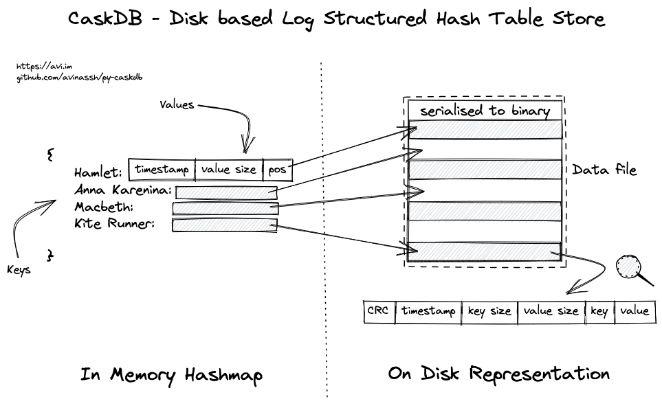

# pycask
A log-structured disk-based key-value store implemented in Python. 

This is an implementation of the BitCask database described in [this paper](https://riak.com/assets/bitcask-intro.pdf). 
The implementation is ideally independent of machine and environment considerations. It also uses no external packages and is restricted to the Python standard library alone, for maximum portability. 

## Usage Guide

Gemeric usage: basic functionality for getting and setting key/value pairs is exposed in [bitcask.py](https://github.com/abaksy/pycask/blob/main/bitcask.py)

```python
import bitcask

datastore = bitcask.BitCaskDataStore()
datastore.put("key1", "value1")
print(datastore.get("key1"))s
datastore.close()
```

### Benchmark Tests

[driver.py](https://github.com/abaksy/pycask/blob/main/driver.py) runs some benchmark tests for key access times for different database sizes (ranging from 10 entries to 1mn entries)

## How bitcask works
The database consists of two major portions, the disk-based data file and an in-memory data structure called the ```keydir```. 


The in-memory ```keydir``` contains the key and the associated value size and offset within the data file so that it can be used for quickly seeking to the correct position within the data file. Everytime the ```BitCaskDataStore``` object is created, it opens the database and creates the keydir in memory for fast lookups. 
## Changelog
1. Made sure to avoid using local timestamps, use UTC timestamps instead for internalization (avoid various kinds of timing bugs)
2. Renamed class ```BitCaskDiskStore``` to ```BitCaskKVPair``` to more accurately reflect what the class actually does


## Credits
Inspiration for this project came from Avinash's project [here](https://github.com/avinassh/py-caskdb/tree/master)